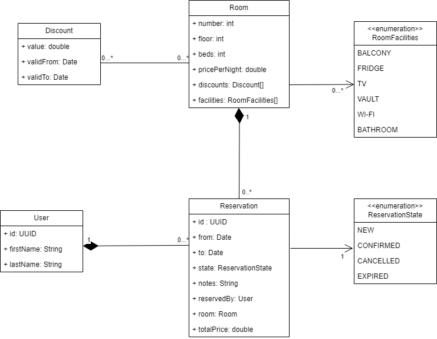

- [Task 2 Solution](#task-2-solution)
  * [Domain model](#domain-model)
    + [Room entity](#room-entity)
    + [User entity](#user-entity)
    + [Reservation entity](#reservation-entity)
    + [Discount entity](#discount-entity)
    + [Summary](#summary)

# Task 2 Solution

## Domain model

The domain model was created in draw.io. The [draw.io file](hotel_reservation_system.drawio) is also attached, from which you
can open the project directly in the application.

The domain model was designed in such a way that it relates only to rooms, it does not address what hotel and location
the room is in.

.

### Room entity

According to the specifications, there should be different types of rooms. Since the configuration of a room can be very
variable, it did not seem appropriate to sort the rooms into several types.

Instead, I chose a variant in which we define the possible facilities and the room can then have any number of these
features (for example Wi-Fi, Balcony, etc..). Together with the price per night, the number of beds and the floor of the
room, the user will be able to nicely filter his room to his preferences.

A room may have more than one reservation, but only one reservation valid for a given time period.

### User entity

The reservation must be created by someone (the customer), so the User entity was created. The entity is created in the
most minimalistic form possible given the task.

If we were to implement a real reservation system, we would have to consider other possible extensions such as:

- the user must be able to log in to the system (must have some username/email and password)
- there can be more types of users (for example customer, admin, or some hotel employee etc...)
- the user wants to store his payment card to simplify the payment process

### Reservation entity

A reservation defines that the customer has booked a given room within a time range. It also defines the total price for
the reservation (number_of_nights * price_per_night - discount).

Although multiple people can then stay in the room, the reservation only applies to one person, the one who created the
reservation. At the same time, there can be only one room in one reservation(if the customer wants to book more rooms,
he must create a separate reservation for each room).

The reservation can then be in several states

- NEW: The reservation has been created and is waiting for the customer to pay
- CONFIRMED: The customer has paid for the reservation
- CANCELLED: The customer has cancelled their reservation
- EXPIRED: The customer has booked but has not paid on time

### Discount entity

Although this wasn't in the assignment, I wanted to expand the assignment slightly.

Through this entity you can add various discounts (in absolute numbers not percentages) to rooms. Each discount has a
range of validity over a period of time.

A room can have multiple active discounts at any given time (but also may not have any), and a discount can be applied
to multiple rooms.

### Summary

This domain model meets all requirements.

- The user can find the desired room types through Room Facilities.

- Room availability can be found out according to time ranges and their statuses. If there is no reservation that
  overlaps in time with the entry and is not in the NEW or CONFIRMED state, then the room is available.

- The user according to this design will be allowed to create a reservation and have a relationship with the given
  reservations.