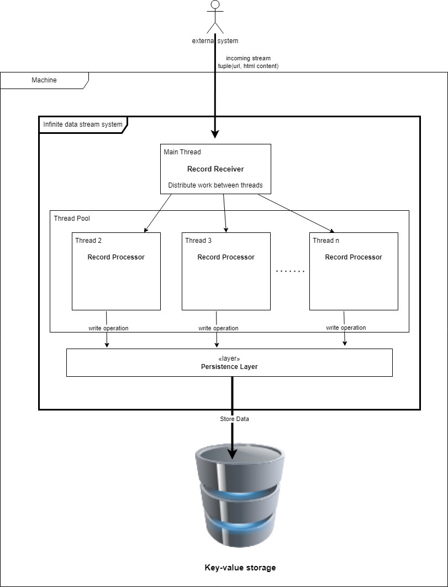
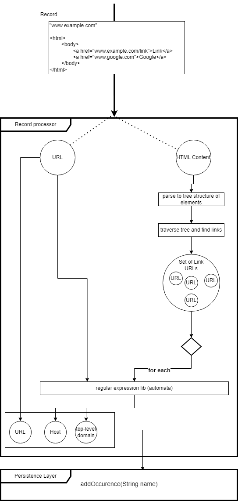

- [System design](#system-design)
    * [Constraints](#constraints)
    * [Key characteristic](#key-characteristic)
    * [System overview](#system-overview)
        + [Programming language](#programming-language)
        + [Database](#database)
        + [Data processing](#data-processing)
    * [Conclusion](#conclusion)

# System design

All diagrams were created in [draw.io](https://draw.io/). Also included are
the [system design](infinite_data_stream_system.drawio) and [data processing component design](record_processor.drawio) files,
which
you can open directly in the application.

## Constraints

- Only one machine
- Limited RAM memory

## Key characteristic

- The goal is to design a system that will process an infinite stream of data as efficiently as possible.
- From the defined constraints we know that the system cannot be horizontally scaled. We only have enough disk space.
- We know from the specification that the application is heavy write, we have to choose the technology accordingly

## System overview

- The first component is the Record Receiver. It receives the new record and then passes it to the available Thread in
  the Thread pool. By using multiple threads, we can increase throughput at least at the single machine level.
- The second component is the Record Processor, which receives a single record, parses the data, extracts the important
  records and writes them to the database.

.

### Programming language

Since we have a limited amount of RAM memory, it is advisable to choose a programming language that has as little
memory consumption as possible.

### Database

Since the system will mostly be writing data and it will be writing occurrences, I think the best choice is to choose a
key-value store database. Key-value stores are suitable for frequent storage of smaller records, which is our case.

Most key-value stores are horizontally scalable, unfortunately we will not be able to take advantage of this advantage
due to limitations.

Example:

| Key (url, host, ...) 	 | Value (occurences) 	 |
|------------------------|----------------------|
| google.com           	 | 15                 	 |
| github.com           	 | 11                 	 |
| seznam.cz            	 | 5                  	 |
| .cz                  	 | 5                  	 |
| .com                 	 | 26                 	 |

### Data processing

- URL processing will be done by finding the desired outputs (host, top-level domain, ...) via regular expressions.
- Since HTML content can contain multiple Links, and we want to process each of them, we first need to convert the HTML
  content into some form in which we can search. This can be a tree of elements. In the tree we then find the link
  elements and process each of them through regular expressions.

  .

## Conclusion

- The system has been designed in such a way that it counts with only one machine. For this reason, the application was
  designed in a multi-threaded fashion so that we could distribute the work evenly. At the same time, this gives us the
  possibility to scale vertically (add RAM, CPU, ...)